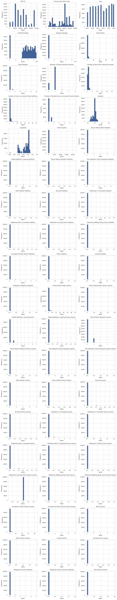
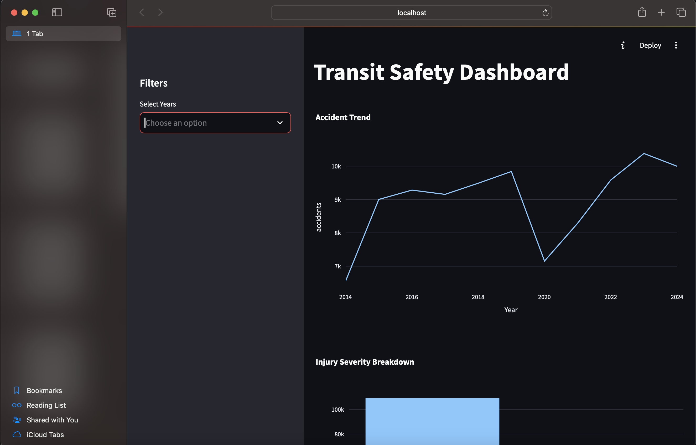

# Transit Safety Analytics 

## Overview

A Streamlit-powered interactive dashboard for analyzing transit safety data, providing insights into accident trends, injury severity, and safety performance across different transportation modes and agencies.

## Features

- **Interactive visualizations** of accident trends and injury severity
- **Filterable data** by year, agency, and transportation mode
- **Leading & lagging indicators** for comprehensive safety analysis
- **Parameterized SQL queries** for secure data access
- **Responsive design** works on desktop and mobile devices

## Project Structure
```
transit-safety-analytics/
│── data                                # This where the data goes
│   ├── cleaned_data.csv.csv
│   │── Major_Safety_Events.csv
│── dashboard.py                        # comprehensive static dashboard
│── saftey_dashboard.py                 # streamlit app fofr the dashboard
│── transit_safety_SQL_analysis.ipynb   # EDA on the data by connecting to SQL and using queries
│── Transit_Saftey_Project_LogReg.ipynb # Machine learning implementation for accident prediction
│── Transit_Saftey_Project.ipynb        # Primary exploratory analysis of transit safety data
│── requirements.txt      # Python dependencies
│── README.md             # Project documentation
```

## Installation

1. Clone the repository:
   ```bash
   git clone https://github.com/yourusername/transit-safety-analytics.git
   cd transit-safety-analytics

2. Create a virtual environment:
   ```bash
   python -m venv venv
   source venv/bin/activate  # On Windows use `venv\Scripts\activate`
   ```
3. Install dependencies:
   ```bash
   pip install -r requirements.txt
   ```

4. Download the data from:
```
https://data.transportation.gov/api/views/9ivb-8ae9/rows.csv?accessType=DOWNLOAD
```
## Usage
1. Running the App
To launch the Streamlit UI, run:
```bash
streamlit run app.py
```

2. Access the dashboard in your browser at http://localhost:8501

3. Use the sidebar filters to explore different data views for different years.

## Outputs

- Starting EDA:



- Prediction Output:
Accuracy: 0.9777924250874613

Confusion Matrix:
 [[18648    40]
 [  398   637]]

Classification Report:
               precision    recall  f1-score   support

           0       0.98      1.00      0.99     18688
           1       0.94      0.62      0.74      1035

    accuracy                           0.98     19723
   macro avg       0.96      0.81      0.87     19723
weighted avg       0.98      0.98      0.98     19723


- Streamlit App:

